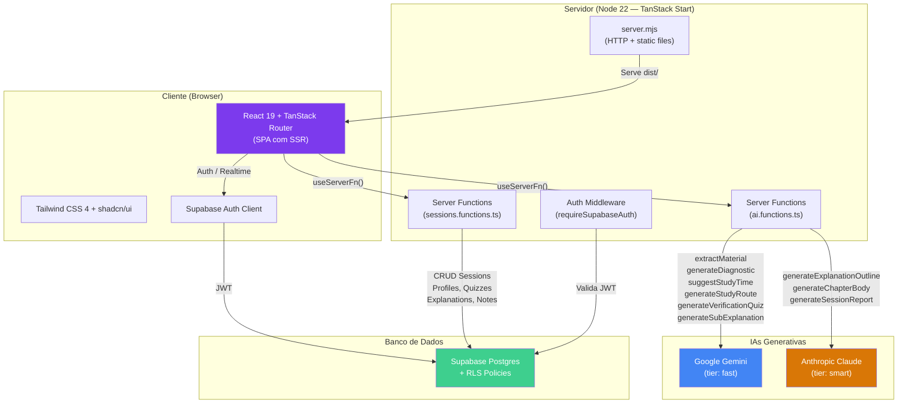
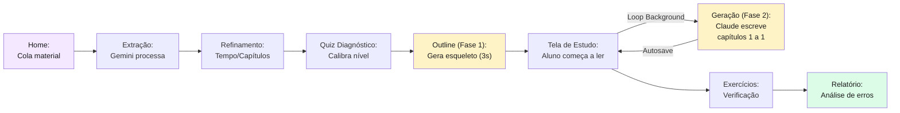
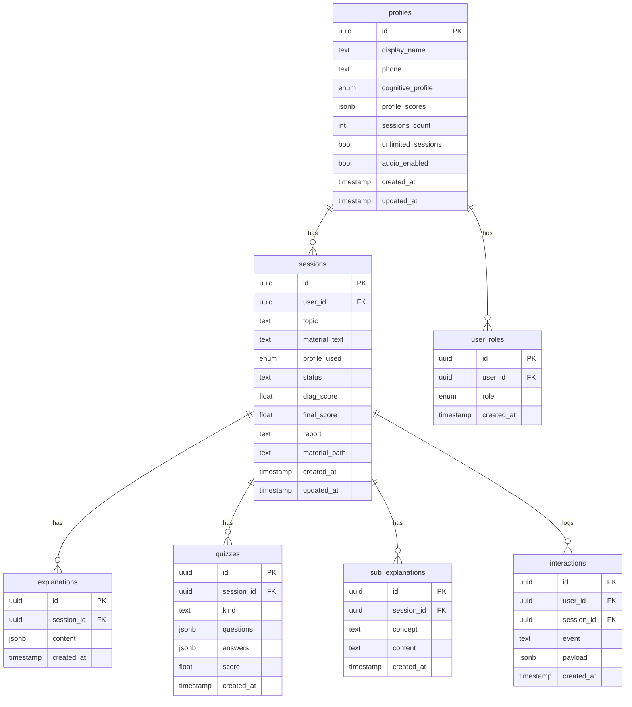

# SincronIA

> Plataforma de estudo personalizado por perfil cognitivo com IA adaptativa.

O aluno envia qualquer material (texto, PDF, foto de apostila), faz um quiz comportamental de 8 perguntas, e a IA gera uma trilha de estudo completa — aula em capítulos, exercícios, relatório de desempenho — tudo adaptado ao jeito que ele aprende.

**Em produção**

---

## ✨ Novidades

- **Geração Dinâmica de Capítulos (Real-time Streaming)** — A aula não trava mais na tela de carregamento! O SincronIA agora gera o Esqueleto (Outline) em 3 segundos e joga o aluno direto na tela de estudo. Os capítulos são escritos pela IA em background, aparecendo **letra por letra em tempo real via SSE (Server-Sent Events) HTTP Stream**, enquanto o aluno lê.
- **Orçamento à Prova de Balas (`max_tokens`)** — Implementação de guilhotina na API da Anthropic + reconstrução de JSON truncado para forçar a IA a respeitar limites estritos de texto (e custo) sem quebrar o app.
- **Dashboard Administrativo Analítico** — Métricas globais precisas que filtram automaticamente usuários ilimitados/testes, exibindo com exatidão a Evolução Média de aprendizado em toda a plataforma.
- **Compact UI (Escalonamento Dinâmico)** — Ajuste nativo global de rem units (80% scale) para que o Design System do Tailwind seja exibido de maneira otimizada e elegante em telas menores (como notebooks).
- **Claude integrado** — O material didático agora é gerado pelo Claude (Anthropic) no tier "smart", entregando aulas com muito mais profundidade, exemplos ricos e linguagem natural.
- **Anotações em tempo real** — Painel de anotações dentro da sessão de estudo, com popup flutuante ou barra lateral acoplada e autosave automático.
- **Refinamento de rota de estudo** — Tela interativa para personalizar a trilha antes de começar (tempo, capítulos, motivo do estudo) via chat com a IA.
- **Diagramas Mermaid Imunes a Falhas** — Renderização de diagramas com um lexer customizado que adiciona aspas de proteção automaticamente em expressões matemáticas problemáticas.
- **Rich Text** — Conteúdo da aula renderizado com Markdown completo (negrito, itálico, listas, código, tabelas, LaTeX).
- **Relatório de desempenho** — Ao finalizar os exercícios, a IA gera um relatório detalhado com análise dos erros e sugestões de revisão.
- **Undo/Redo de aula** — Ao regenerar ou trocar perfil, o aluno pode voltar e avançar entre versões da aula.

---

## 🏗️ Arquitetura



### Diagrama de Fluxo do Aluno (Streaming Architecture)



---

## 🧠 Perfis Cognitivos

O quiz comportamental de 8 perguntas classifica o aluno em um dos 6 perfis:

| Perfil | Descrição |
|---|---|
| **Sistemático** | Sequência lógica, definições precisas, progresso etapa a etapa |
| **Pragmático** | Teoria em ação — casos reais antes da definição formal |
| **Explorador** | Mapa geral do tema, escolhe caminho, profundidade e ordem |
| **Associativo** | Pontes e analogias com conhecimento prévio |
| **Investigativo** | Densidade e camadas — quer ir além do necessário |
| **Concreto Guiado** | Conduzido passo a passo, do exemplo simples ao complexo |

Cada perfil gera um `profileGuideline` diferente que é injetado no prompt da IA, alterando estilo, estrutura e abordagem do material.

---

## ⚙️ Stack Técnica

| Camada | Tecnologia |
|---|---|
| **Framework** | TanStack Start (SSR + Server Functions) |
| **UI** | React 19 + Tailwind CSS 4 + shadcn/ui (Radix) |
| **Roteamento** | TanStack Router (file-based) |
| **Banco** | Supabase (Postgres + Auth + RLS) |
| **IA Fast** | Google Gemini (`gemini-2.5-flash` / configurável) |
| **IA Smart** | Anthropic Claude (`claude-3-5-sonnet` / configurável) |
| **Diagramas** | Mermaid.js (renderizado client-side) |
| **Validação** | Zod (schemas em server functions) |
| **Runtime** | Node 22 |
| **Deploy** | Docker multi-stage → Coolify (VPS) |

---

## 📂 Estrutura de Pastas

```
.
├── src/
│   ├── routes/                   # Rotas (file-based routing)
│   │   ├── __root.tsx            #   Layout raiz (Toaster, QueryClient)
│   │   ├── index.tsx             #   Redirect → /home
│   │   ├── home.tsx              #   Landing page + login/cadastro
│   │   ├── auth.tsx              #   Tela de autenticação dedicada
│   │   ├── refinement.tsx        #   Chat IA para refinar rota de estudo
│   │   ├── session.$id.tsx       #   Sessão de estudo (aula + exercícios)
│   │   ├── estudos.tsx           #   Visualização de estudo (modo antigo)
│   │   ├── dashboard.tsx         #   Painel do aluno (sessões + relatórios)
│   │   ├── admin.tsx             #   Painel admin (gestão de usuários)
│   │   └── inicio.tsx            #   Landing institucional
│   │
│   ├── components/
│   │   ├── ProfileQuizModal.tsx  #   Modal do quiz de perfil cognitivo
│   │   ├── estudos/
│   │   │   ├── ChapterViewer.tsx #     Renderiza capítulo da aula
│   │   │   ├── DiagnosticQuiz.tsx#     Quiz diagnóstico pré-aula
│   │   │   ├── ExerciseViewer.tsx#     Exercícios de verificação
│   │   │   ├── Mermaid.tsx       #     Renderizador de diagramas Mermaid
│   │   │   ├── NotesPanel.tsx    #     Painel de anotações (popup/docked)
│   │   │   ├── RichText.tsx      #     Parser Markdown → React
│   │   │   └── StudySidebar.tsx  #     Barra lateral de ações do estudo
│   │   └── ui/                   #   Componentes shadcn/ui (Radix)
│   │
│   ├── lib/
│   │   ├── ai.functions.ts       #   Server functions de IA (Gemini + Claude)
│   │   ├── sessions.functions.ts #   CRUD Supabase (sessions, profiles, notes)
│   │   ├── profiles.ts           #   Definição dos 6 perfis + guidelines
│   │   ├── profile-quiz.ts       #   Lógica do quiz (perguntas + scoring)
│   │   ├── pending-profile.ts    #   Gerenciamento de perfil pendente
│   │   ├── history.ts            #   Histórico local (localStorage)
│   │   ├── demo.ts               #   Dados de demonstração
│   │   ├── error-page.ts         #   Página de erro customizada
│   │   └── utils.ts              #   Helpers (cn, etc.)
│   │
│   ├── integrations/supabase/
│   │   ├── client.ts             #   Cliente Supabase (browser)
│   │   ├── client.server.ts      #   Cliente Supabase (server, service role)
│   │   ├── auth-middleware.ts    #   Middleware requireSupabaseAuth
│   │   ├── auth-attacher.ts      #   Attach auth headers
│   │   └── types.ts              #   Tipos auto-gerados do schema
│   │
│   ├── assets/                   #   Imagens e ícones dos perfis
│   ├── styles.css                #   CSS global (tema, variáveis, animações)
│   ├── router.tsx                #   Configuração do TanStack Router
│   └── start.ts                  #   Middlewares globais
│
├── supabase/
│   └── migrations/               #   5 migrations SQL (schema + RLS)
│
├── server.mjs                    #   HTTP listener (estáticos + SSR)
├── Dockerfile                    #   Imagem de produção (multi-stage)
├── Dockerfile.dev                #   Imagem de desenvolvimento
├── docker-compose.yml            #   Orquestração local (dev)
├── vite.config.ts                #   Configuração Vite
└── package.json                  #   Dependências e scripts
```

---

## 🗄️ Schema do Banco (Supabase)



---

## 🤖 Server Functions (API)

### IA (`ai.functions.ts`)

| Função | Tier | Descrição |
|---|---|---|
| `extractMaterial` | fast | Extrai texto e tópico de material bruto (texto/PDF/imagem) |
| `generateDiagnostic` | fast | Gera quiz diagnóstico para calibrar nível do aluno |
| `suggestStudyTime` | fast | Sugere tempo de estudo baseado no material |
| `generateStudyRoute` | fast | Gera rota de estudo com capítulos personalizados |
| `generateExplanation` | **smart** | Gera aula completa em capítulos (Claude) |
| `generateSubExplanation` | fast | Explica conceito específico dentro da aula |
| `generateVerificationQuiz` | fast | Gera exercícios de verificação pós-aula |
| `generateSessionReport` | **smart** | Gera relatório de desempenho final (Claude) |

### CRUD (`sessions.functions.ts`)

| Função | Método | Descrição |
|---|---|---|
| `getMyProfile` | GET | Retorna perfil do usuário autenticado |
| `upsertProfile` | POST | Atualiza perfil cognitivo e scores |
| `createSession` | POST | Cria nova sessão (com controle de limite) |
| `getSession` | GET | Retorna sessão + explanation + quizzes + notes |
| `updateSessionRoute` | POST | Atualiza rota de estudo da sessão |
| `confirmSessionCreation` | POST | Confirma criação da sessão |
| `saveExplanation` | POST | Salva/sobrescreve explicação da sessão |
| `saveQuiz` | POST | Salva quiz (diagnóstico ou verificação) |
| `saveUserNotes` | POST | Salva anotações do aluno na sessão |
| `saveSessionReport` | POST | Salva relatório de desempenho |
| `listSessions` | GET | Lista sessões do usuário (últimas 50) |
| `consumeExtraUsage` | POST | Consome 1 uso do limite gratuito |

---

## 🔐 Segurança

- **RLS (Row Level Security)** em todas as tabelas — cada usuário só vê seus próprios dados.
- **Auth Middleware** (`requireSupabaseAuth`) valida JWT em toda server function.
- Chaves de API (Gemini, Claude) ficam apenas no servidor, nunca no bundle do client.
- Service Role Key exposta no client apenas para `/admin` (a ser migrado para server-side).

---

## Pré-requisitos

- **Node 22** (https://nodejs.org) — rodar via npm
- **Docker Desktop** — rodar via Docker
- Conta no [Supabase](https://supabase.com) (URLs/keys do projeto)
- Chave da API do [Google AI Studio](https://aistudio.google.com/apikey) (Gemini)
- Chave da API da [Anthropic](https://console.anthropic.com/) (Claude)

## Setup do `.env`

Copie o exemplo e preencha:

```bash
cp .env.example .env
```

Variáveis necessárias:

| Nome | Onde usar |
|---|---|
| `VITE_SUPABASE_URL` | URL do projeto Supabase |
| `VITE_SUPABASE_ANON_KEY` | Chave anon do Supabase |
| `VITE_SUPABASE_SERVICE_ROLE_KEY` | Service role (necessária para `/admin`) |
| `SUPABASE_URL` | Mesmo valor de `VITE_SUPABASE_URL` |
| `SUPABASE_SERVICE_ROLE_KEY` | Mesmo valor da service role |
| `GEMINI_API_KEY` | Chave(s) da API do Gemini (separar por vírgula) |
| `GEMINI_MODEL` | Ex: `gemini-2.5-flash` |
| `CLAUDE_API_KEY` | Chave(s) da API do Claude (separar por vírgula) |
| `CLAUDE_MODEL` | Ex: `claude-3-5-sonnet-20241022` |

O `.env` está no `.gitignore` — nunca commite chaves de verdade.

## Rodar localmente com npm

```bash
npm install
npm run dev
```

Abre em http://localhost:5173 com hot reload.

## Rodar localmente com Docker

```bash
docker compose up
```

Primeira execução faz build da imagem (~1 min). Próximas iniciam em segundos.

Abre em http://localhost:5173 — mesmo hot reload do npm (o código é montado via volume).

Para parar: `Ctrl+C` no terminal, ou em outra janela:

```bash
docker compose down
```

## Build de produção (testar local)

Reproduz exatamente o que roda na VPS:

```bash
npm run build
node server.mjs
```

Abre em http://localhost:3000.

Ou via Docker (replica 1:1 a imagem do Coolify):

```bash
docker build -t sincronia .
docker run --rm -p 3000:3000 --env-file .env sincronia
```

## Scripts

| Comando | O que faz |
|---|---|
| `npm run dev` | Servidor de dev (Vite, porta 5173, HMR) |
| `npm run build` | Build de produção → `dist/` |
| `npm start` | Roda o build de produção (`node server.mjs`) |
| `npm run lint` | ESLint em todo o projeto |
| `npm run format` | Prettier em todo o projeto |

---

## 📄 Licença

Projeto privado — todos os direitos reservados.
